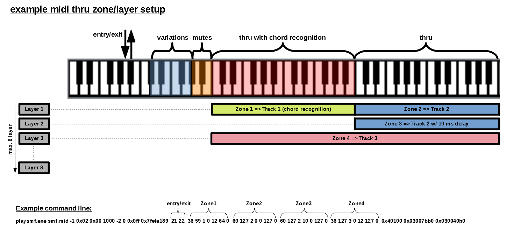
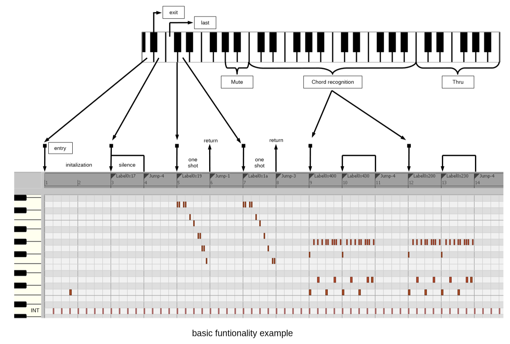

# playsmf

playsmf is a small, but powerful Windows (32/64bit) commandline standard midi file (SMF) player. Its specifically designed for low CPU and memory consumption to leave enough system recources for other applications such as soft-synths, DAWs, mixer apps, etc. while playing live and running in background.

In addition it comes with intrinsic flow control features based on labels, jumps and interrupts defined by smf marker events. This allows to program loops, breaks, fills, intros, outros, etc. In combination with realtime interrupt control, based on incoming midi data with or without chord recognition, the player can turn into an fully fledged arpeggiator. However unlike typical arpeggiators or style players, the player doesnt do any (more or less intelligent) modification such as transpose, volume adjustments, etc. to the smf midi data and plays strongly the raw data as provided by the smf. This means you know exacly what gets played with each individual chord, however the smf needs to provide individual pattern for all required key/scale/inversion combinations which are played during a live session. Therefore its possible to play individual pattern - for instance with randomized timings/volume/controller/sysex events - for each individual chord.

### output MIDI devices
The player generally allows to play across multiple output devices simultaneously. Typically devices are chosen by SMF Meta-Event 0x20 (port select) for each individual track. Since the player uses those messages to switch beween output devices accordingly, it is valid to switch devices while playing within a sequence. If such port-select events are missing, the player uses the default midi output device.

### MIDI-Thru and track-follow mode
The player generally supports MIDI-Thru functionality with split and multi-layer modes for live-performances. However instead assigning fixed devices/channels to play on, you can assign tracks to follow their current device/channel combinations while playing. This enables dynamic MIDI-Thru (re)assignments during a live performance.

### general system integration
The player runs as a standalone console application more or less in background and is mainly controlled by the primary midi input device/controller. In addition, the computer keyboard controls only sequence restart (CTRL+PAUSE/BREAK) and sequence exit (CTRL+C) flow control jumps.

For seamless system integration along with your faforite DAWs, software synthesizers, virtual midi controllers, etc. it is strongly recommented to install virtual midi routers/cables to connect playsmf with other applications. Especially since MIDI devices are typically blocked when opened by one client, it is possible to route additional (secondary slaved) input devices thru playsmf to all open output devices. This allows to hook real or virtual midi controllers (mixer applications, etc.) thru playsmf to all open outputs.

### Labels
Labels are basically address markers defining entry-points for either jumps or interrupts into the smf sequence. Internally they represent numerical addresses pointing to the next midi event within the smf data stream. Address labels can have any (positive) numerical value as long as they get only used in combination with intrinsic flow control using jumps. However in combination with external interrupts, they have to follow a certain structure with rules (see interrupt section). Numerical values can be presented in decimal or hexadecimal (0x) notation.

Two Labels are always present: "sequence-start" and "sequence-exit". "sequence-start" represents a label pointing to the very first event in your sequence while "sequence-exit" presents a label after the very last event. Those labels can be used to restart or exit your sequence and can be triggered by either <KeyStart>/<KeyExit> MIDI-keys or alternatively by CTRL-PAUSE/BREAK or CTRL-C.

### Auto-Labels (Label-1)
One specific type of labels are Auto-Labels. Essentially they represent automatically generated internal labels and can only be used in combination with relative jumps since their absolute address is not puplic.

### Jumps
Jumps are basically branches jumping immediately to target address labels. The target label can either be a (positive) absolute address or a (negative) relative number of labels for relative backward jumps or looping. Numerical values can be presented in decimal or hexadecimal (0x) notation.

### Interrupts
Interrupts are basically breaks stopping the current midi flow by jumping to defined target address labels. They are typically requested by external MIDI (NoteOn/Off) events either directly by single keys or thru the chord recognition module. Since both NoteOn and Off events can request individual interrupts with different address labels, its possible to trigger different sequences by either pressing keys down or releasing them.

### Interrupt sync
In order to guarantee smooth interrupt flow transitions, interrupts are only taken at either jump points or certain defined midi messages within the sequence. For instance this can be a metronome click NoteOn message or a specific controller event.

### Return from interrupt (Jump-1/Jump-3)
One specific jump type is "return-from-interrupt". Actually there are two basic types of sequences: "non-return" (e.g. ending in a infinite loop) or "return" ending with an "return-from-interrupt" jump. Return-type sequences terminate with an immediate jump back to the caller sequence bei either restarting the caller sequence from its interrupt entry point (Jump-1) or from the latest label playing when interrupted (Jump-3).

### Mute sets
A mute-set represents a list of simultaneously muted tracks. So with multiple distinct mute-sets, it is possible to mute and unmute multiple tracks simultaneously. For smooth mute/unmute transitions, a requested mute-set change is only taken at interrupt sync points. Mute-sets are primarily used to build pattern variations. They can get switched in realtime with the keys below the chord recognition zone. Two default mute-sets are always defined: mute-all and unmute-all.

### Midi thru and track follow mode
For live performance, midi thru functionality with multi-zone (split) and multi-layer functionality is implemented. However instead of specifying fixed target output port/channel combinations, midi thru gets hooked to tracks and follows their port/channel combination while playing. That provides the flexibility to change the midi thru output with the individual pattern played. For instance one can assign all major chords to one output while all minor chords get routed to another one.

### Typical "style" smf structure
A style-like smf structure starts typically with an initialization sequence at the very beginning. This part contains all events (sysex, controller, local control off, etc.) to setup the midi equipment. Once finished, it can immediately go into a "silent-loop" just waiting for input. In order to hear if the player is alive, you can additionally put a quiet metronome click into the silent-loop. After that, the data section starts containing all data for the various chord types (major, minor, sus2, etc.). At the very end, you can put another sequence which gets only transmitted when the player finishes (e.g. turn local control on, etc).

The player comes with specific features such as:

- intrinsic realtime player flow control using jump/branch commands in combination with target address labels (primarily used for loops)
- realtime midi controlled jumps (interrupts) in combination with target address labels
- chord recognition for midi realtime interrupt/break/jump control
- multiport capability controlled by SMF Port metaevents per track
- SysEx in/out support
- multi-layer/multi-zone midi thru functionality based on "track follow mode" (thru port/channel follows selected tracks)
- realtime midi controlled mutes/unmutes based on "mute-sets" (mute/unmute multiple tracks simultaneously at interrupt break points)
- record/save all incoming midi and sysex events into standard midi files

### usage:

`playsmf.exe <MidiFile> <TimerPeriod> <DefaultMidiOutputDevice> <DefaultMidiInputDevice> <TimeOut> <Channel> <Ofs> <REC> <INT> <KeyStart> <KeyExit>`

*  0 `playsmf.exe` - application
*  1 `<MidiFile>` - inputfile *.mid
*  2 `<TimerPeriod>` - windows timer resolution in ms or -1 if not used
*  3 `<DefaultMidiOutputDevice>` - default midi output device ID
*  4 `<DefaultMidiInputDevice>`  - default primary midi input device ID
*  5 `<TimeOut>` - primary midi-input timeout in ms or -1 if not used (player will close if there is no midi activity)
*  6 `<Channel>` - primary midi-input channel filter/router used for midi-thru functionality
*  7 `<Ofs>` - primary midi in key offset [-127:0:127]
*  8 `<REC>` - midi recording filter (default 0xff - off)
*  9 `<INT>` - interrupt message control filter (default 0x00008000 - all messages)
* 10 `<KeyStart>` - start key (EntryLabel)
* 11 `<KeyExit>` - exit key (ExitLabel)

##### additional options beyond argument address >= 12:

`ThruZone ::= (<LowKey> <HighKey> <Track> <Delay> <KeyOffset> <Von> <Voff>)`

Defines a midi-thru zone with the following mantadory attributes/parameters:

* `<LowKey>`    lowest  key in zone [0:127] (if <=-2 use <LowKey> from previous zone; if -1 use <HighKey>+1 from previous zone)
* `<HighKey>`   highest key in zone [0:127] or <range> if negative
* `<Track>`     assigned track [-1,0:n] (-1: no assignment)
* `<Delay>`     delay im ms [0:n] (experimental feature - use in rare cases with only small delay values to achive flanger-type effects)
* `<KeyOffset>` transpose [-127:0:127] or fixed key [128:255]
* `<Von>`       note-on  velocity modulator <0xssoo>: <ss> 0=1,([1:5:255]-1)*.25 -> [1,0:1:63.5] scale factor; <oo> [-127:0:127] offset
* `<Voff>`      note-off velocity modulator <0xssoo>: <ss> 0=1,([1:5:255]-1)*.25 -> [1,0:1:63.5] scale factor; <oo> [-127:0:127] offset

notes/comments/terminologies:
 - multiple zones can be defined consecutively
 - chord recognizion key range is always derrived from the 1st defined zone in argument list (mandatory zone - even though chord recognition is not used)
 - midi-thru works generally in 'track-follow-mode' with the primary midi input attached to individual tracks following their output device/channel combinations while playing
 - each individual key allows having up to 8 zones/tracks (layers) attached
 - 'active' zones/tracks are all zones (tracks) belonging to the latest pressed key
 - incoming channel messages including controller, pitch-bend, program-change, etc. are generally routed to active zones/tracks only. this allows to change selectively patches, volumes, pannings, etc. for active zones only while playing
 - exceptions are foot/pedal controller such as soft, sostenuto and sustain which are generally sent across all defined zones/tracks simultaneously
 - tracks can get dynamically re-assigned while playing by changing the incoming midi channel. to enable this option, <Channel> needs to be <= -2. in this case, the received channel is added to the target tracks.
 
port/device mapping
If the smf contains port-select meta-events where port numbers doesnt match to target device-IDs, you can apply additional port->device mappings.
`<0x0001ppDD>` maps smf-port `<pp>` to device `<DD>`
`<0x0003ppDD>` same as above, but devices count reverse starting with max-1 device number

secondary slaved midi-input devices
In case you want to hook additional real or virtual midi-equipment such as controller, mixer, keyboards, etc. to your output devices while playing, you can route them thru playsmf attaching directly to midi-tracks in track-follow mode. This might be required for devices using single client midi drivers. Typically those drivers dont allow to open multiple clients in parallel. Since this option works in track-follow-mode, each incoming channel is routed to one corresponding track starting from track `<TT>`.
`<0x0002TTDD>` opens secondary slaved midi input device `<DD>` attaching to track `<TT>`
`<0x0004TTDD>` same as above, but devices count reverse starting with max-1 device number

midi device reset options
In order to reset midi equipment upon player start and/or exit, you can optionally define individual midi messages (typically controller reset messages) sent across all devices/channels before the player starts and after the player exists.
`<0x01mmmmm0>` start midi message (play given message across all channels before smf sequence starts)
`<0x02mmmmm0>` exit midi message (play given message across all channels after smf sequence stops)
`<0x03mmmmm0>` start/exit midi message (play given message across all channels before and after smf sequence starts/stops)

smf intrinsic arguments
In order to store command line arguments with the smf, the player supports sequencer specific meta messages to set and/or override command line arguments.
Argument data is stored as 32-bit integer values `<DD>` starting from argument address `<AA>` followed by one or more arguments.

`<0xff> <length> <0x7f> <0x00> <0xab> <0xcd> <0x00> <AA[31:24]> <AA[23:16]> <AA[15:8]> <AA[7:0]> (<DD[31:24]> <DD[23:16]> <DD[15:8]> <DD[7:0]>)*`
