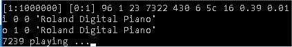

# playsmf

playsmf is a small, but powerful Windows (32/64bit) commandline standard midi file (SMF) player. Its specifically designed for low CPU and memory consumption to leave enough system recources for other applications such as soft-synths, mixer apps, etc. while playing live and running in background.

In addition it comes with intrinsic flow control features based on Labels, jumps and interrupts defined by smf marker events. This allows to program loops, breaks, fills, intros, outros, etc. In combination with realtime interrupt control based on incoming midi data with chord recognition, the player can turn into an fully fledged arpeggiator. However unlike typical arpeggiators or style players, the player doesnt do any (more or less intelligent) modification such as transpose, volume adjustments, etc. to the smf midi data and plays strongly the raw data as provided by the smf. This means you know exacly what gets played with each individual chord, however the smf needs to provide individual pattern for all required key/scale/inversion combinations which are played during a live session. Therefore the arpeggiator can even play individual pattern - for instance with randomized timings/volume/controller/sysex events - for each individual chord.

The player comes with specific features such as:

- intrinsic realtime player flow control using jump/branch commands in combination with target address labels (primarily used for loops)
- realtime midi controlled jumps (interrupts) in combination with target address labels
- chord recognition for midi realtime interrupt/break/jump control
- multiport capability controlled by SMF Port metaevents per track
- SysEx in/out support
- multi-layer/multi-zone midi thru functionality based on "track follow mode" (thru port/channel follows selected tracks)
- realtime midi controlled mutes/unmutes based on "mute-sets" (mute/unmute multiple tracks simultaneously at interrupt break points)
- record/save all incoming midi and sysex events into standard midi files

usage:

`playsmf.exe <MidiFile> <TimerPeriod> <DefPortOut> <DefPortIn> <TimeOut> <Channel> <Ofs> <REC> <INT>  <KeyStart> <KeyStop>  <KeyChordStart> <KeyChordStop>`

* `<MidiFile>` - inputfile *.mid
* `<TimerPeriod>` - windows timer resolution in ms or -1 if not used
* `<DefPortOut>` - default output port
* `<DefPortIn>` - default input port
* `<TimeOut>` - midi in timeout in ms or -1 if not used (player will close if no midi in message received within this period)
* `<Channel>` - channel used for chord recognition (-1 means all channes are used)
* `<Ofs>` - midi in key offset (default 0)
* `<REC>` - turns on midi recording (0xff means off)
* `<INT>` - interrupt message control for styles (default 0x00008000 - all messages)
* `<KeyStart>` - start key (EntryLabel)
* `<KeyStop>` - stop key (ExitLabel)
* `<KeyChordStart>` - lowest key used for chord recognition
* `<KeyChordStop>` - highest key used for chord recognition`
