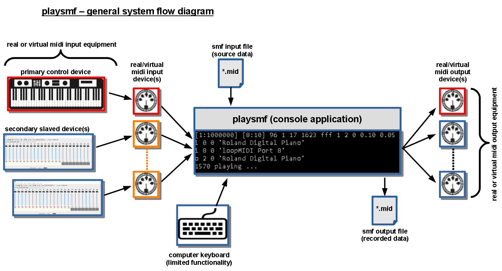

# playsmf

playsmf is a small, but powerful Windows (32/64bit) commandline standard midi file (SMF) player. Its specifically designed for low CPU and memory consumption to leave enough system recources for other applications such as soft-synths, DAWs, mixer apps, etc. while playing live and running in background.

In addition it comes with intrinsic flow control features based on labels, jumps and interrupts defined by smf marker events. This allows to program loops, breaks, fills, intros, outros, etc. In combination with realtime interrupt control, based on incoming midi data with or without chord recognition, the player can turn into an fully fledged arpeggiator. However unlike typical arpeggiators or style players, the player doesnt do any (more or less intelligent) modification such as transpose, volume adjustments, etc. to the smf midi data and plays strongly the raw data as provided by the smf. This means you know exacly what gets played with each individual chord, however the smf needs to provide individual pattern for all required key/scale/inversion combinations which are played during a live session. Therefore its possible to play individual pattern - for instance with randomized timings/volume/controller/sysex events - for each individual chord.

### Labels
Labels are basically address markers defining entry-points for either jumps or interrupts into the smf sequence. Internally they represent numerical addresses pointing to the next midi event within the smf data stream. Address labels can have any (positive) numerical value as long as they get only used in combination with intrinsic flow control using jumps. However in combination with external interrupts, they have to follow a certain structure with rules (see interrupt section). Numerical values can be presented in decimal or hexadecimal (0x) notation.

### Auto-Labels (Label-1)
One specific type of labels are Auto-Labels. Essentially they represent automatically generated internal labels and can only be used in combination with relative jumps since their absolute address is not puplic.

### Jumps
Jumps are basically branches jumping immediately to target address labels. The target label can either be a (positive) absolute address or a (negative) relative number of labels for relative backward jumps or looping. Numerical values can be presented in decimal or hexadecimal (0x) notation.

### Interrupts
Interrupts are basically breaks stopping the current midi flow by jumping to defined target address labels. They are typically requested by external MIDI (NoteOn/Off) events either directly by single keys or thru the chord recognition module. Since both NoteOn and Off events can request individual interrupts with different address labels, its possible to trigger seperate sequences by either pressing keys down or releasing them.

### Interrupt sync
In order to guarantee smooth interrupt flow transitions, interrupts are only taken at either jump points or certain defined midi messages within the sequence. For instance this can be a metronome click NoteOn message or a specific controller event.

### Return from interrupt (Jump-1/Jump-3)
One specific jump type is "return-from-interrupt". Actually there are two basic types of sequences: "non-return" (e.g. ending in a infinite loop) or "return" ending with an "return-from-interrupt" jump. Return-type sequences terminate with an immediate jump back to the caller sequence bei either restarting the caller sequence from its interrupt entry point (Jump-1) or from the latest label playing when interrupted (Jump-3).

### Mute sets
A mute-set represents a list of simultaneously muted tracks. So with multiple distinct mute-sets, it is possible to mute and unmute multiple tracks simultaneously. For smooth mute/unmute transitions, a requested mute-set change is only taken at interrupt sync points. Mute-sets are primarily used to build pattern variations. They can get switched in realtime with the keys below the chord recognition zone. Two default mute-sets are always defined: mute-all and unmute-all.

### Midi thru and track follow mode
For live performance, midi thru functionality with multi-zone (split) and multi-layer functionality is implemented. However instead of specifying fixed target output port/channel combinations, midi thru gets hooked to tracks and follows their port/channel combination while playing. That provides the flexibility to change the midi thru output with the individual pattern played. For instance one can assign all major chords to one output while all minor chords get routed to another one.

### Typical "style" smf structure
A style-like smf structure starts typically with an initialization sequence at the very beginning. This part contains all events (sysex, controller, local control off, etc.) to setup the midi equipment. Once finished, it can immediately go into a "silent-loop" just waiting for input. In order to hear if the player is alive, you can additionally put a quiet metronome click into the silent-loop. After that, the data section starts containing all data for the various chord types (major, minor, sus2, etc.). At the very end, you can put another sequence which gets only transmitted when the player finishes (e.g. turn local control on, etc).

The player comes with specific features such as:

- intrinsic realtime player flow control using jump/branch commands in combination with target address labels (primarily used for loops)
- realtime midi controlled jumps (interrupts) in combination with target address labels
- chord recognition for midi realtime interrupt/break/jump control
- multiport capability controlled by SMF Port metaevents per track
- SysEx in/out support
- multi-layer/multi-zone midi thru functionality based on "track follow mode" (thru port/channel follows selected tracks)
- realtime midi controlled mutes/unmutes based on "mute-sets" (mute/unmute multiple tracks simultaneously at interrupt break points)
- record/save all incoming midi and sysex events into standard midi files

usage:

`playsmf.exe <MidiFile> <TimerPeriod> <DefPortOut> <DefPortIn> <TimeOut> <Channel> <Ofs> <REC> <INT>  <KeyStart> <KeyStop>  <KeyChordStart> <KeyChordStop>`

* `<MidiFile>` - inputfile *.mid
* `<TimerPeriod>` - windows timer resolution in ms or -1 if not used
* `<DefPortOut>` - default output port
* `<DefPortIn>` - default input port
* `<TimeOut>` - midi in timeout in ms or -1 if not used (player will close if no midi in message received within this period)
* `<Channel>` - channel used for chord recognition (-1 means all channes are used)
* `<Ofs>` - midi in key offset (default 0)
* `<REC>` - turns on midi recording (0xff means off)
* `<INT>` - interrupt message control for styles (default 0x00008000 - all messages)
* `<KeyStart>` - start key (EntryLabel)
* `<KeyStop>` - stop key (ExitLabel)
* `<KeyChordStart>` - lowest key used for chord recognition
* `<KeyChordStop>` - highest key used for chord recognition`
